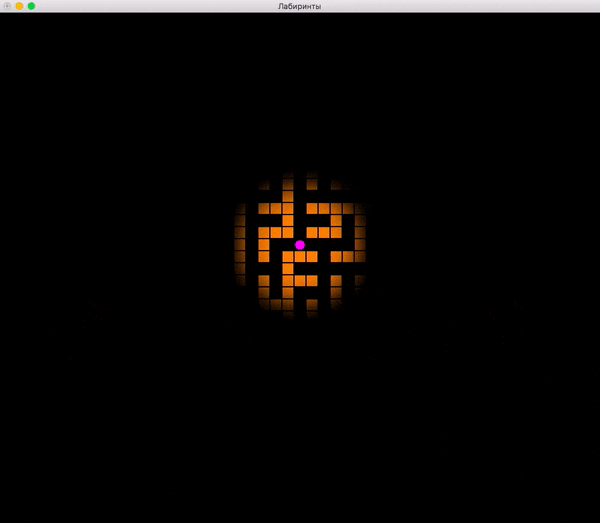

# demo-maze

Брождение по случаному лабиринту.



## Сборка и запуск

Клонируйте репозиторий:

```
git clone https://github.com/cmc-haskell-2017/demo-maze.git
cd demo-maze
```

Соберите проект при помощи [утилиты Stack](https://www.haskellstack.org):

```
stack setup
stack build
```

Собрать проект и запустить игру можно при помощи команды

```
stack build && stack exec demo-maze
```

## Задание

В качестве задания к [лекции «Моноидная свёртка»](https://youtu.be/JOYh5ngQzxU) требуется
реализовать [функцию `canMove`](https://github.com/cmc-haskell-2017/demo-maze/blob/master/src/Maze.hs#L121-L123).

Как только вы реализуете эту функцию, перемещаться по лабиринту станет труднее.
